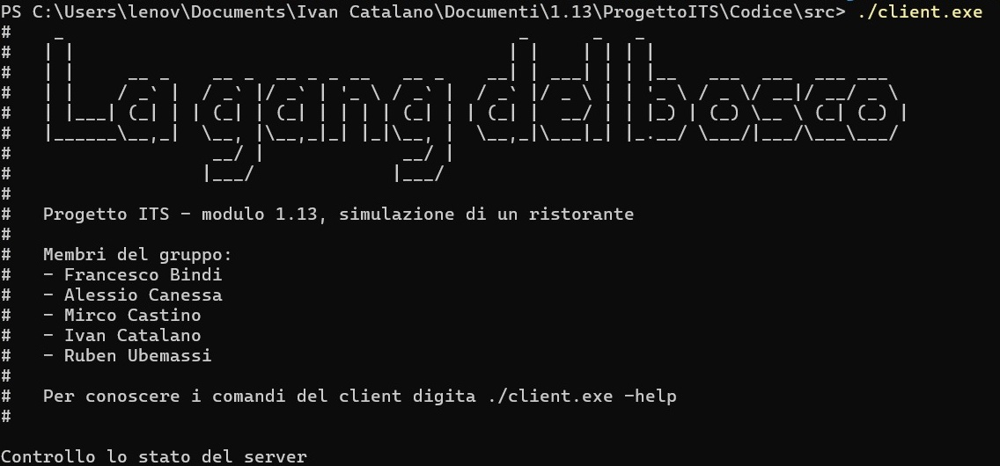
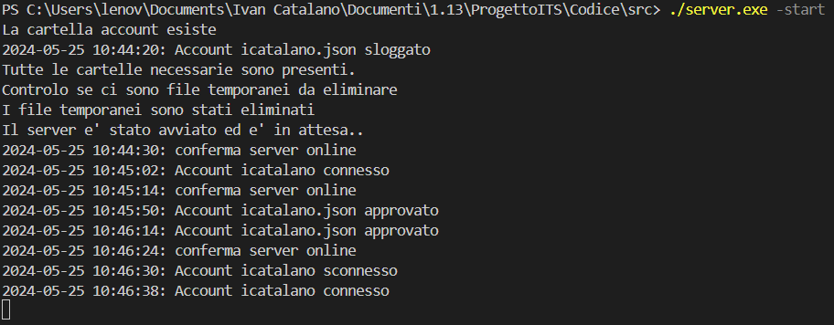
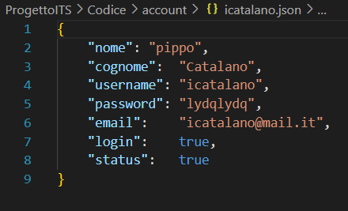
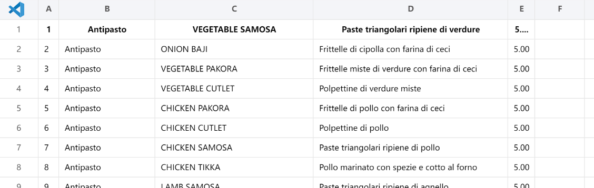
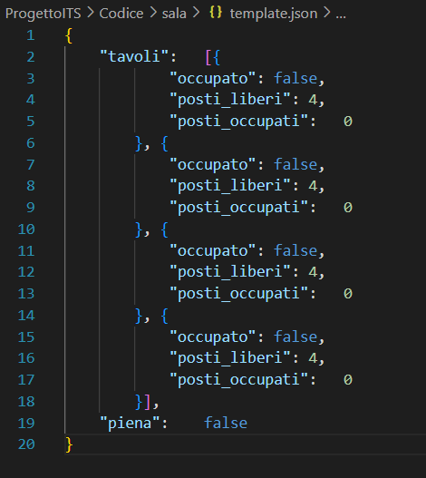
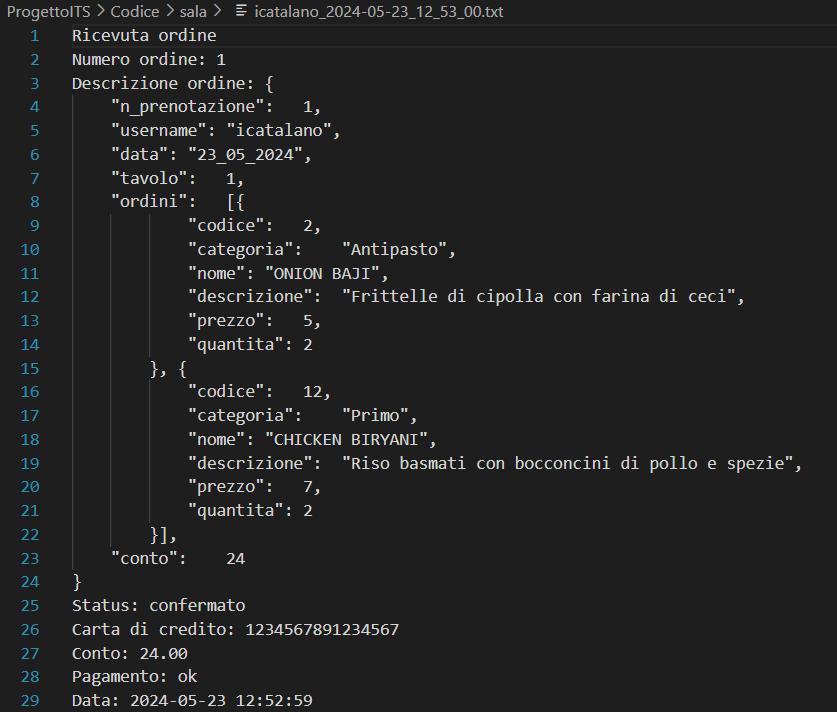
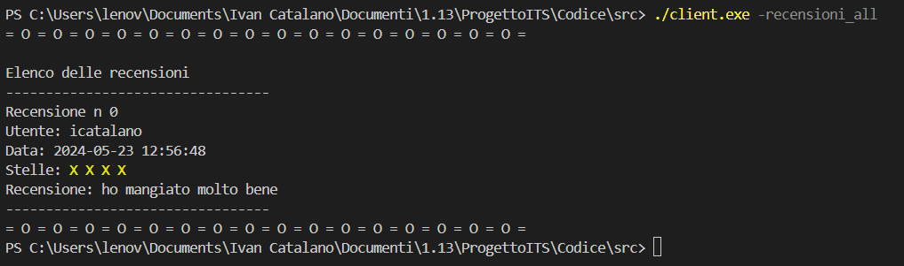

# ProgettoITS: La Gang del Bosco

# Definizione delle caratteristiche del progetto

Il lavoro di gruppo consiste nel progettare, implementare, documentare e testare un'applicazione per la gestione di un ristorante. Questa app deve avere le seguenti funzionalità:

    Gestione utenti,
    Prenotazione Tavoli,
    Gestione del Menu,
    Gestione Ordini,
    Feedback dei Clienti.

Per ogni entità (ove logicamente prevedibile) saranno previste le operazioni di:

    inserimento,
    modifica,
    cancellazione,
    visualizzazione.

I dati dovranno essere salvati in modo da poter essere utilizzati dopo un riavvio dell’applicazione. (usare preferibilmente un database)
L’applicazione dovrebbe essere composta da un modulo client e da un modulo server. (requisito opzionale)

# Analisi dei requisiti

La progettazione dell'applicazione è avvenuta tramite il metodo Scrum, l'utilizzo dei diagrammi Use Case e Sequence, il testing dell'applicazione in modalità BlackBox e la realizzazione del diagramma di Gantt.
La prima operazione svolta è stata l'analisi dei requisiti e la pesatura delle card, mediante il metodo del poker.

Nella cartella UML sono presenti tutti i diagrammi d'uso e di sequenza scritti.

Abbiamo deciso di optare per una architettura client/server con la comunicazione mediante file temporanei e archiviazione su file tipo jSON, csv e txt. Il linguaggio di programmazione scelto è C, con l'uso di una libreria esterna dell'autore[ DaveGamble, cJSON](https://github.com/DaveGamble/cJSON).

# Guida d'uso

## Avvio del Server

La sequenza di avvio dell'app prevede l'avvio del server per il tramite del comando:

    ./server.exe -start

Questo comandlo lancia il server, che come prima azione controllerà l'esistenza di tutte le cartelle funzionali al corretto funzionamento del client, creandole in caso di assenza. La seconda operazione che fa è una cancellazione di tutti i file temporanei. Successivamente si mette in ascolto delle richieste che arrivano dal client in un loop infinito. 

- Richiesta di status (attivo/inattivo) del server
- Approvazione/modifica di account appena creati/modificati
- Login/Logout utenti
- Richieste di prenotazione di tavoli
- Richieste di ordinazioni delle portate dal menu (con pagamento ed emissione della ricevuta)
- Rilascio di recensioni

L'interruzione del server può avvenire con *CTRL+C.*

## Uso del Client:

Per comprendere le operazioni eseguibili con il client, si può leggere la guida digitando _./Client.exe --help_. I comandi a disposizione sono del tipo ./client.exe [PARAM] [OPTION/S].

### Gestione dell'account

Per la gestione degli utenti i *PARAM* e le *OPTIONS* sono:

    Creazione account:		-c, senza options.

Consente la creazione di un account nuovi. Verranno richiesti i dati utenti e la password verrà cifrata e resa non visibile durante la digitazione. Lo username è soggetto a controllo di esistenza e la password deve essere almeno di 8 caratteri.

    Visualizzazione account:	-v, seguito da "username".

Consente ad un account loggato, di visualizzare i dati dell'account, comprese le prenotazioni e le ordinazioni effettuate. 

    Modificare account:		-m, seguito da "username".

Consente ad un account loggato, di modificare i campi di nome, cognome, mail e password. Lo username non è modificabile.

    Eliminazione account:		-e, seguito da "username".

Consente ad un account loggato, di eliminare l'account, comprese le prenotazioni effettuate. GLi ordini e le recensioni non vengono rimosse, in quanto storico del ristorante. Anche le ricevute emesse non vengono cancellate.

    Login e Logout:			-login, -logout, seguiti da "username".

Consentono il login e il logout dell'utente. Verrà richiesta la digitazione della password per entrambe le operazioni.

La gestione dell'account avviene tramite l'uso di un file jSON, il cui nome sarà: username.json. Il contenuto del file sarà il seguente:

Il jSON ha questo formato:

La password viene criptata con il cifrario di cesare con chiave 3. I valori di *"login"* e *"status"* sono quei valori del file che verranno modificati, rispettivamente, nelle operazioni di login e logout dell'utente e nelle operazioni di creazione/modifica account.

Le operazioni di dialogo tra client e server verranno gestite tramite un file temporaneo dedicato.

### Gestione Sala/Menu

Per la gestione della sala e del menu i *PARAM* e le *OPTIONS* sono:

    Visualizzazione del menu:	-menu, senza opzioni.

Il menu del ristorante è editato esternalmente su un file di tipo csv. Il Client ha accesso a questo file in sola lettura, che lo visualizza quando richiesto dalle varie funzionalità. L'editing è quindi fisico da parte dell'amministratore del sistema o da un dipendente del ristorante. La visualizzazione del menu è accessibile senza login.

    Visualizzazione della sala:	-sala, seguito da "data[gg/mm/aaa]".

La visualizzazione della sala prevede il passaggio di una sola option che è la data in formato gg/mm/aaaa. La visualizzazione della sala è visibile senza login.

Il file della sala è di tipo data.json e si compone come segue:

## Gestione Prenotazione

Per accedere a questa funzionalità occorre essere loggati con il proprio utente. Se non lo si è verrà richiesto il login al momento dell'utilizzo.

Per la gestione della prenotazione i *PARAM* e le *OPTIONS* sono:

    Prenotazione di un tavolo:		-p_tavolo, seguito da "username" e "data[gg/mm/aaa]".

La prenotazione del tavolo richiede l'invio dello username e della data in cui si vuole prenotare, nel formato gg/mm/aaaa. Il client effettuerà dei controlli e se non esiste alcun file di sala lo creerà alla data corrispondente, copiandolo dal template.json. Se invece è presente, farà visualzizare e modificare quel file. Al momento della prenotazione verranno richiesti tavolo e numero di posti. E' possibile fare prenotazioni multiple nella stessa data. Il client a questo punto elaborerà un file temporaneo per comunicare con il server dove verranno indicati i tavoli e i posti nel file da modificare. Il server farà le modifiche sul file modificando i campi del jSON in modo opportuno e restituirà una conferma nel file temporaneo. Successivamente registrerà la prenotazione in un file di archivio in csv. A questo punto il client darà un messaggio di avvenuta prenotazione.

    Eliminazione di una prenotazone:	-e_tavolo, seguito da "username" e "numero_prenotazione"

Per l'eliminazione del tavolo il dialogo client/server è analogo. In questo caso però è richiesto il numero della prenotazione. Tra client e server avverrà un dialogo con un file temporaneo nel quale vengono trasmesse le informazioni. Il server effettuerà la cancellazione riscrivendo il file di archivio in csv e ripristinando il file jSON della sala corrispondente alla data della prenotazione.

La modifica della prenotazione non ha un comando diretto, ma si effettua eliminando e ricreando la prenotazione.

## Gestione Ordini

Per accedere a questa funzionalità occorre essere loggati con il proprio utente. Se non lo si è verrà richiesto il login al momento dell'utilizzo.

Per la gestione degli ordini i PARAM e le OPTIONS sono:

    Effettuare un ordine dal menu:		 -ordine, seguito da "username".

La creazione dell'ordine parte dall'esistenza di una prenotazione in carico all'utente. L'utente a questo punto sceglie la prenotazione a cui collegare l'ordine. A questo punto il client chiederà quali portate si vuole ordinare visualizzando il menu diviso categorie. Alla fine dell'ordine, verranno chiesti i dati di pagamento. Il client scriverà su un file temporaneo i dati della richiesta di ordine, che il server leggerà. Con questi dati il server aggiornerà il file degli ordini.csv, ed emetterà la ricevuta di pagamento.

Un esempio di ricevuta è questa:

    Eliminare un ordine effettuato:		-e_ordine, seguito da "username" e "numero_ordine"

Per l'eliminazione dell'ordine il procedimento è analogo a quello dell'eliminazione della prenotazione. In questo caso però è richiesto il numero dell'ordine. Tra client e server avverrà un dialogo con un file temporaneo nel quale vengono trasmesse le informazioni. Il server effettuerà la cancellazione riscrivendo il file di archivio in csv.

Per l'ordinazione non è prevista una procedura di modifica in quanto il pagamento conferma l'ordine e lo esegue. Se non si vuole confermare l'ordine basta interrompere la procedura di pagamento e rifare l'ordine. 

# Gestione Feedback

La pubblicazione della recensione chiude il cerchio della prenotazione. Pubblicando una recensione viene eliminata la prenotazione, ma non gli ordini e  le ricevute che rimangono in archivio.

Per la gestione delle recensioni i *PARAM* e le *OPTIONS* sono:

    Pubblicare una recensione:		-recensione, seguita da "username".

La recensione è dunque pubblicabile solo se esiste una prenotazione collegata all'account.

    Visualizzare tutte le recensioni:	-recensioni_all, senza options.

Questa funzionalità è accessibile senza login e consente di visualizzare tutte le recensioni pubblicate.

Le recensioni non possono essere modificate dal cliente. Eventualmente solo manualmente dal proprietario del ristorante agendo sul file direttamente.
